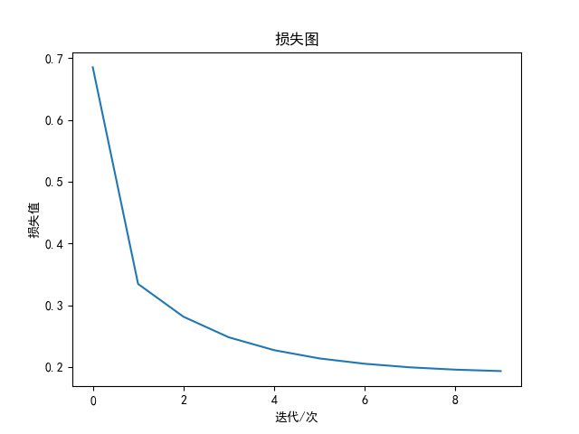
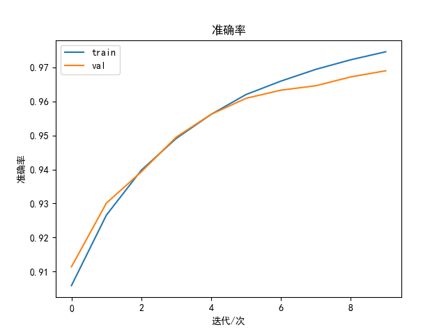

# 使用示例

使用`PyNet`非常简单，类似`PyTorch`实现方式

* 第一步：创建数据集并进行预处理
* 第二步：创建网络模型对象
* 第三步：创建评价函数对象
* 第四步： 创建优化器对象
* 第五步：创建求解器对象，设置训练参数，训练
* 第六步：打印和绘制训练结果

以`examples/2_nn_mnist.py`为例

## 头文件加载

```
import pynet
import pynet.models as models
import pynet.optim as optim
import pynet.nn as nn
from pynet.vision.data import mnist
from pynet.vision import Draw
```

## 创建数据集并进行预处理

```
data_path = '~/data/decompress_mnist'

x_train, x_test, y_train, y_test = mnist.load_mnist(data_path, shuffle=True, is_flatten=True)

x_train = x_train / 255 - 0.5
x_test = x_test / 255 - 0.5

data = {
    'X_train': x_train,
    'y_train': y_train,
    'X_val': x_test,
    'y_val': y_test
}
```

## 创建网络模型对象

```
model = models.TwoLayerNet(num_in=784, num_hidden=200, num_out=10)
```

## 创建评价函数对象

```
criterion = nn.CrossEntropyLoss()
```

## 创建优化器对象

```
optimizer = optim.SGD(model.params)
```

## 创建求解器对象，设置训练参数，训练

```
solver = pynet.Solver(model, data, criterion, optimizer, batch_size=128, num_epochs=10)
solver.train()
```

## 打印和绘制训练结果

```
plt = Draw()
plt(solver.loss_history)
plt.multi_plot((solver.train_acc_history, solver.val_acc_history), ('train', 'val'),
                title='准确率', xlabel='迭代/次', ylabel='准确率')
print('best_train_acc: %f; best_val_acc: %f' % (solver.best_train_acc, solver.best_val_acc))
```

训练日志如下

```
$ python 2_nn_mnist.py 
epoch: 1 time: 1.08 loss: 0.684346
train acc: 0.8880; val_acc: 0.8914
epoch: 2 time: 1.00 loss: 0.337981
train acc: 0.9131; val_acc: 0.9162
epoch: 3 time: 1.05 loss: 0.284188
train acc: 0.9320; val_acc: 0.9320
epoch: 4 time: 1.01 loss: 0.249591
train acc: 0.9448; val_acc: 0.9439
epoch: 5 time: 0.99 loss: 0.227722
train acc: 0.9528; val_acc: 0.9493
epoch: 6 time: 0.99 loss: 0.213616
train acc: 0.9592; val_acc: 0.9547
epoch: 7 time: 1.00 loss: 0.204579
train acc: 0.9640; val_acc: 0.9594
epoch: 8 time: 1.04 loss: 0.198835
train acc: 0.9685; val_acc: 0.9642
epoch: 9 time: 1.03 loss: 0.195210
train acc: 0.9715; val_acc: 0.9669
epoch: 10 time: 1.01 loss: 0.193020
train acc: 0.9738; val_acc: 0.9684
best_train_acc: 0.973767; best_val_acc: 0.968400
```



